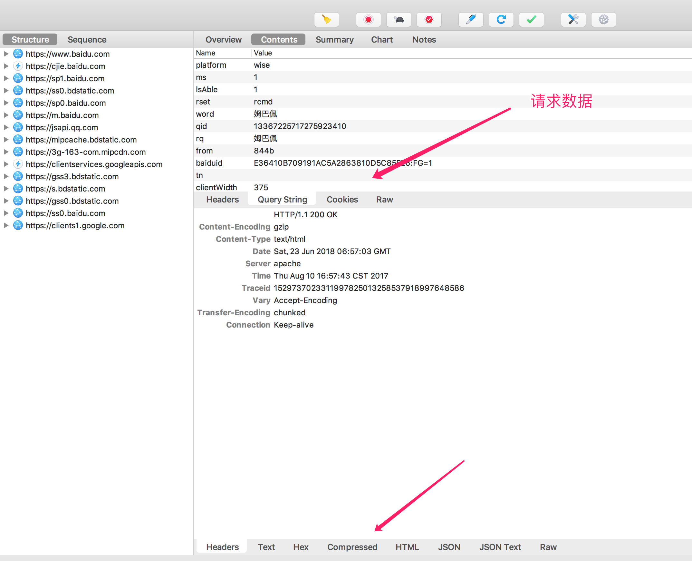

# Chrales 使用
废话不多说直接进入主题！
## 安装
安装请直接前往 [*官方网站*](https://www.charlesproxy.com/) 下载， 鉴于该工具是付费使用，在体用体验到期之后，每次只能使用30分钟，因此通过破解一次到位，后续使用无忧。 
破解方式： 
&nbsp;&nbsp;&nbsp;&nbsp;&nbsp;&nbsp;&nbsp;下载破解包：[Chrales在线破解工具](https://www.zzzmode.com/mytools/charles/)，RegisterName是自定义的文件名称，选择对应的版本号，生成破解包并下载。 
&nbsp;&nbsp;&nbsp;&nbsp;&nbsp;&nbsp;&nbsp;安装：Mac下，在应用程序中找到 Chrales 点击之后选择 ‘显示包含内容’，将下载的破解包覆盖到 Contents/Java/ 下后重启 Chrales即可。Windows下，将文件覆盖到 C:\Program Files\Charles\lib\。
## 使用
### 1、设置代理
使用将以Mac的使用进行演示 
&nbsp;&nbsp;&nbsp;&nbsp;&nbsp;&nbsp;&nbsp;Chrales 是通过将自己设置为代理服务器来实现封包截取的，因此第一步就是设置代理，打开 Chrales 在菜单中选择 Proxy > macOS Proxy

此时，刷新目标页面即看到页面的网络请求出现。

网络请求过多时，可以通过下方 Filter 进行筛选选择需要截取的网络请求设置断点，点击一条网络请求，选择 Breakpoints, 再次刷新页面，该页面中的网路请求将会被拦截，此时便可以对网络请求进行监视或者修改。 
### 2、应用场景演示：***单页应用项目，调试线上代码***， 
其实就是拦截网络请求，通过修改资源访问路劲，在线上访问本地打包的本地代码。
前面提到设置断点后刷新页面，此时tab栏新增Breakpoints,列表中就会有设置了断点的网路请求，上图： 
1、点击编辑请求

2、点击执行

3、编辑响应，选择HTML,替换入口文件，

注意：在替换入口文件之前，最好是在打包好的入口文件中将线上资源的公共路径修改为本地路径 “http://127.0.0.1:8080/dist/, 否则会报错 Loading chunk * failed,因为替换的入口文件是本地文件，在线上是没有入口文件要引用的资源的。之后，线上环境就是访问你本地打包好的代码了，从而实现了对线上环境的模拟，降低频繁上线的成本。
### 3、移动端抓包
配置： 

chrales 配置

iphone配置
mac和手机连接统一wifi的情况下，在手机设置中打开无线局域网，点击当前连接的wifi，选择最后配置代理，进入配置界面做如下设置,设置服务器为电脑ip，端口号统一之前的设置为8888,记得点击存储。

接下来打开一个app,请求就会被 chrales 拦截，点击allow,

在 chrales 中就可看到当前app发出的请求了，

例如在百度中发起一次搜索请求

,

拦截请求，修改参数

,

以上纯属个人使用笔记，忘记时方便查看，希望对看到的你有帮组！
